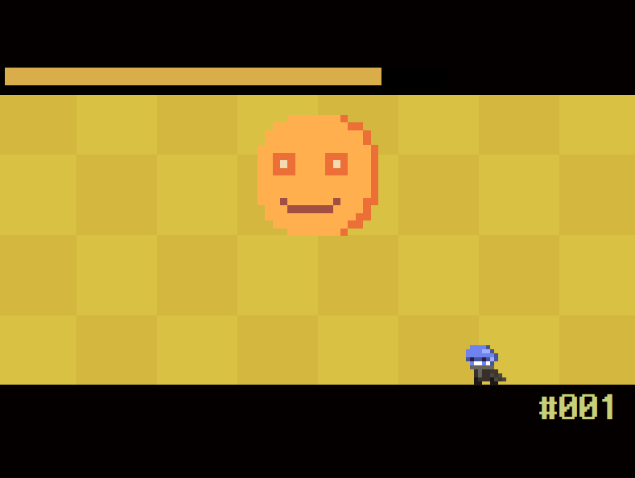
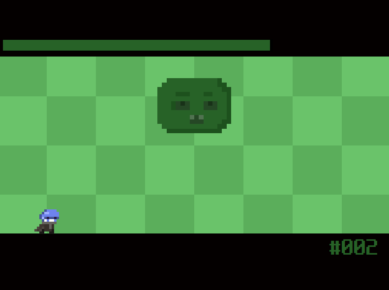
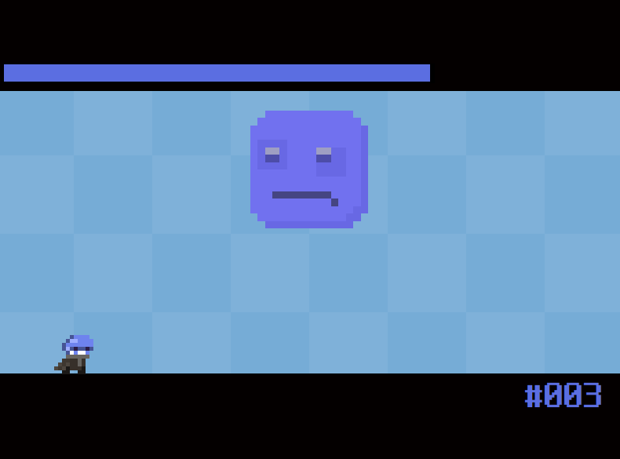
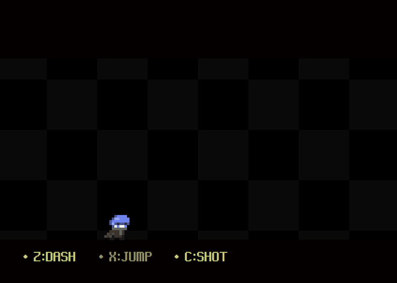
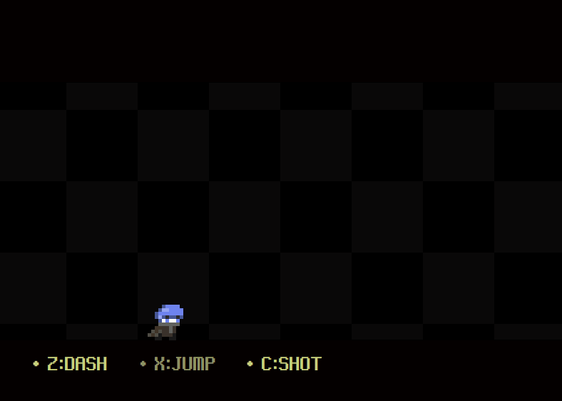
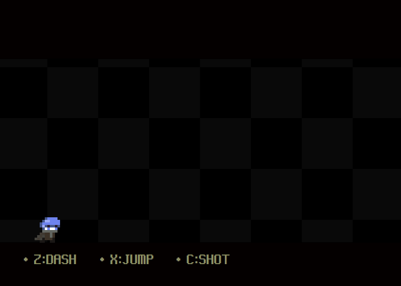
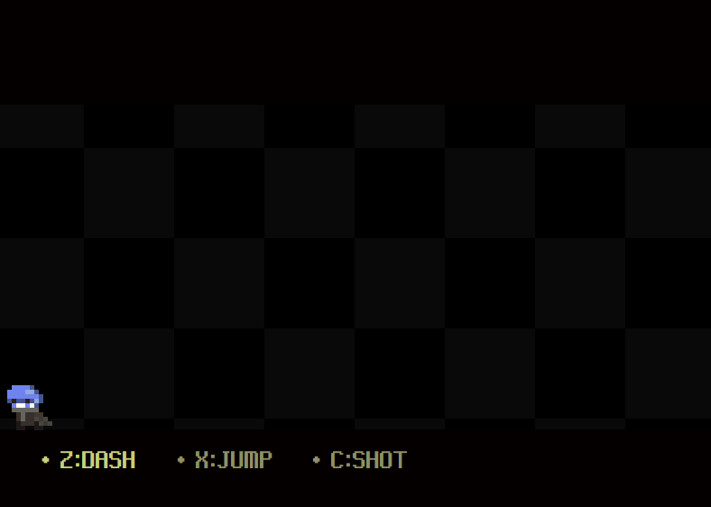
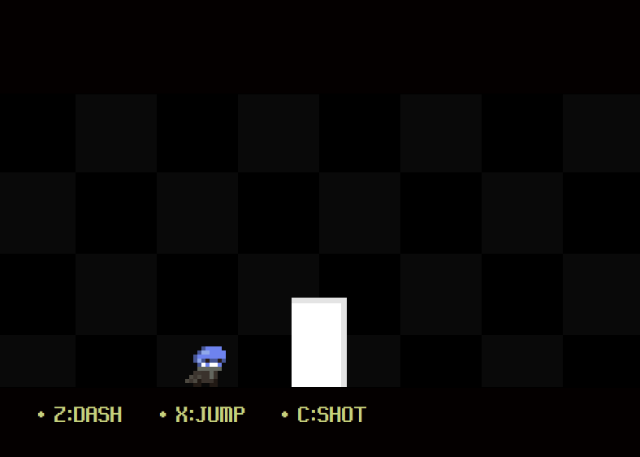

# DREAMIN

[**다운로드 바로가기**](https://drive.google.com/file/d/1NyNnK5bCA9hRgJhQKi62bwb4VmMycPdx/view?usp=sharing)
 
[**다운로드시 주의사항**](https://github.com/ehdbs28/DREAMIN/blob/main/ReadmeResource/DownloadInfo.md)

`대쉬`와 `점프` 그리고 `공격` 간단한 조작으로 다양한 패턴을 가진 보스를 격파해나가는 보스러쉬 액션 게임입니다. 

 

## 게임 소개

게임 내에는 각기 다른 패턴을 가진 3개의 보스가 존재합니다. 플레이어는 각각의 보스를 물리치며 다음 보스로 향해갈 수 있습니다.

 

## 게임 플레이 방법

`left` 와 `right` 키로 기본적인 좌우 움직임이 가능합니다. `x` 키로 점프하고 `c` 키로 총알을 발사할 수 있습니다.

`z` 키를 눌러 대쉬할 수 있습니다. `up` 키 또는 `down` 키를 함께 누르면 위 아래로 대쉬하며 중력을 반전시킵니다. `left` 키 또는 `right` 키를 함께 누르면 좌우로 대쉬합니다.

각 스테이지를 클리어 하면 나오는 포탈에 서서 `up` 키를 누루면 다음 스테이지로 넘어갈 수 있습니다.